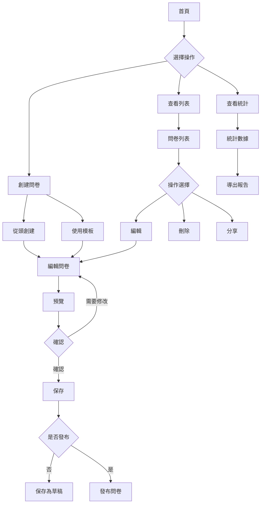
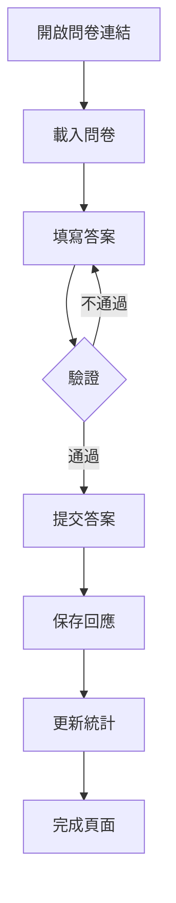
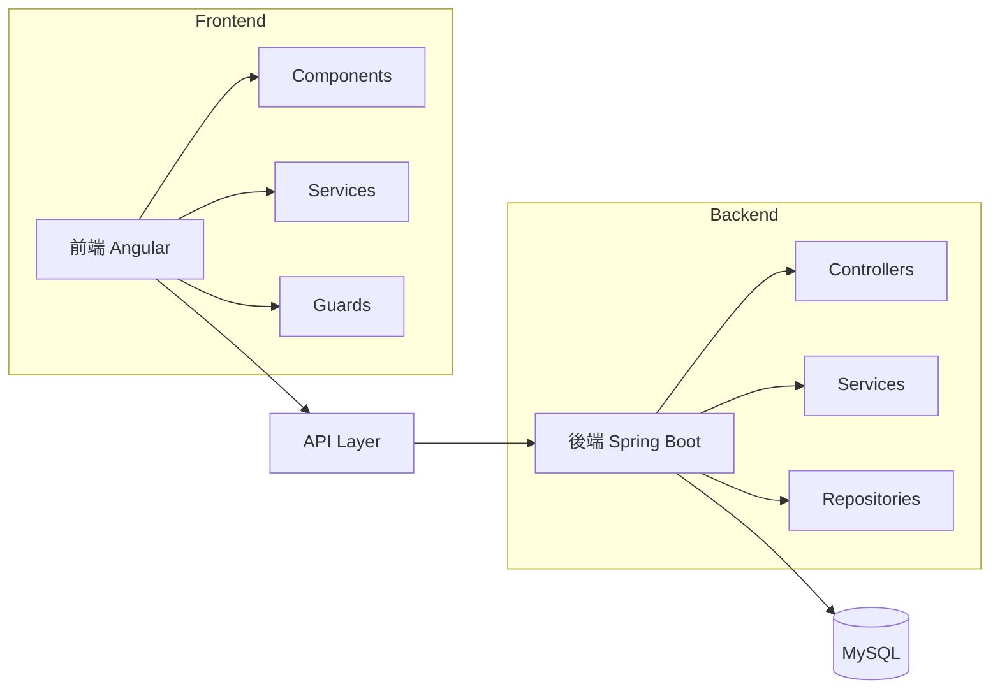
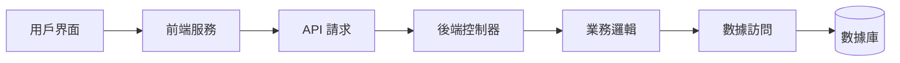
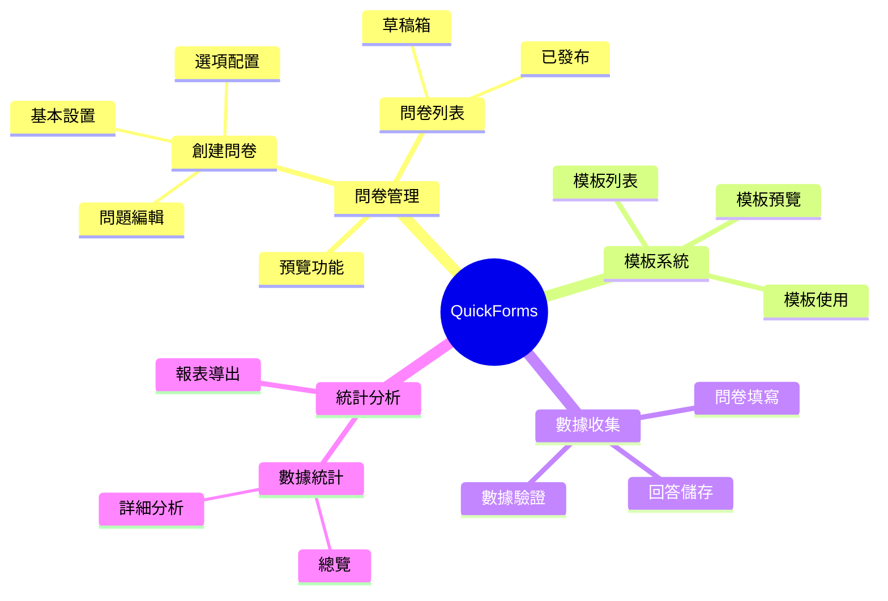
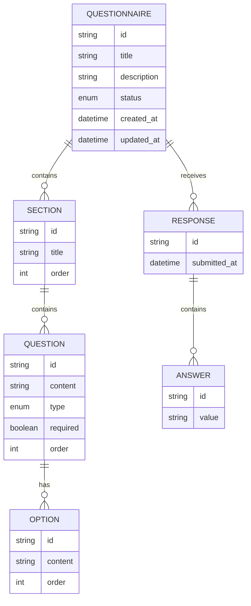
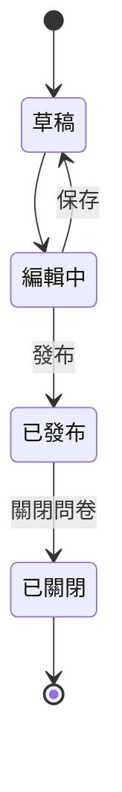
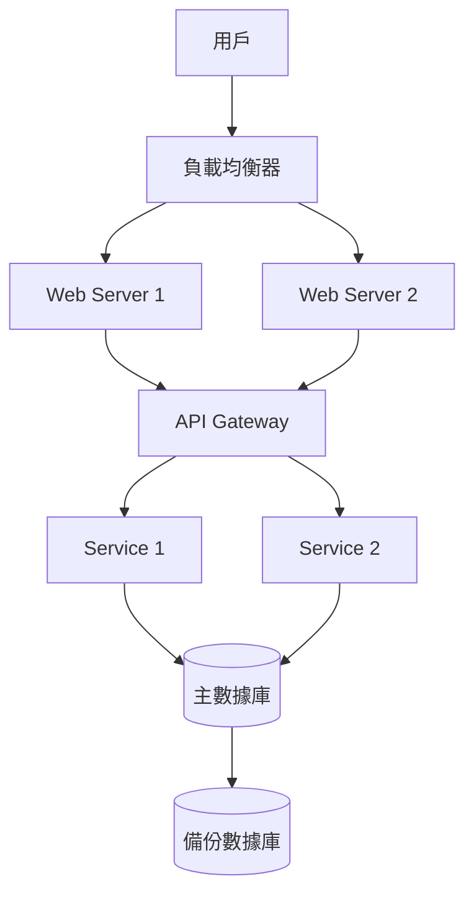

# QuickForms 系統流程圖與架構圖

## 1. 用戶操作流程

### 1.1 問卷管理流程

### 1.2 問卷填寫流程

## 2. 系統架構圖

### 2.1 前後端架構

### 2.2 數據流向圖

## 3. 功能模塊圖

## 4. 數據模型關係

## 5. 狀態流轉圖

## 6. 部署架構圖

這些圖表使用 Mermaid 語法繪製，可以：
1. 在支持 Mermaid 的 Markdown 查看器中查看
2. 使用 Mermaid Live Editor (https://mermaid.live) 查看和編輯
3. 在 GitHub 上直接查看

每個圖表都清晰展示了系統的不同方面：
- 用戶操作流程
- 系統架構
- 功能模塊
- 數據關係
- 狀態流轉
- 部署架構
